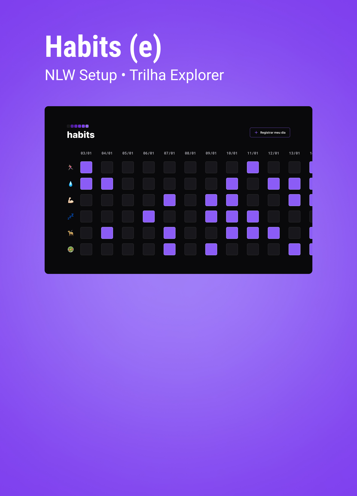

<h1 aling= "center"> Habits </h1>

NLW é um Programa gratuito, promovido pela Rocketseat para o ensino de tecnologias WEB para o rastreamento de dados
 

  <a href="#-tecnologias"> Tecnologias</a>&nbsp;&nbsp;&nbsp;&nbsp;&nbsp;&nbsp;
  <a href="#projeto">Projeto</a>&nbsp;&nbsp;&nbsp;&nbsp;&nbsp;&nbsp;
  <a href="#layout">Layout</a>&nbsp;&nbsp;&nbsp;&nbsp;&nbsp;&nbsp;
  <a href="memo-licença">Licença</a>

 

## 🔋 Tecnologias

Esse projeto foi desenvolvido usando as seguintes tecnologias:

- HTML e CSS
- JavaScript
- Git e Github
- Figma

## 💻 Projeto

O Habits lista os hábitos que você se colocou a cumprir no ano, com atualizações diárias para rastrear os feitos

- [acesse o projeto finalizado,online] ()

## Layout

Você pode visualizar o layout do projeto através [Desse Link] (https://www.figma.com/community/file/1187422022288947321)
É necessário ter conta no [Figma] (https://figma.com) para acessá-lo.

## :memo: Licença

Esse projeto esta sob licença MIT.